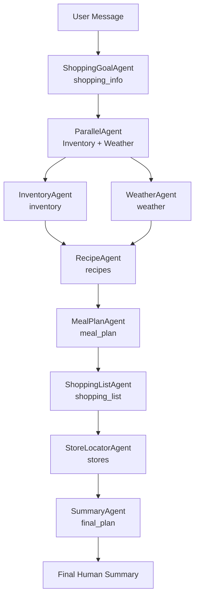

# PantryPilot: Multi-Agent Meal Planning, Pantry Intelligence & Smart Grocery Assistant

> **PantryPilot** is a multi-agent system that turns a single natural-language request into:
> - A 5-day healthy meal plan (breakfast, lunch, snack, dinner)  
> - An estimated pantry inventory (what you likely have vs what you need)  
> - A categorized shopping list  
> - Weather-aware shopping advice (walk vs delivery)  
> - 2–3 nearby stores that likely carry your ingredients  

## 1. Problem & Motivation

Weekly meal planning is deceptively hard. A single "What should I eat this week?" question hides many sub-problems:

- *What ingredients do I already have in my pantry?*  
- *What healthy meals can I cook using those ingredients?*  
- *What exactly do I need to buy, and where should I buy it?*  
- *Is the weather good enough to walk, or should I get delivery?*  
- *How do I make this efficient and not spend hours planning?*

For students, busy professionals, or anyone without a car, this becomes stressful and often leads to:

- Food waste  
- Unnecessary grocery runs  
- Poor nutritional choices  
- Decision fatigue  

## 2. Solution Overview

**PantryPilot** is an **Multi-agent system** that automates the entire cooking workflow from your message:

> _"I need to buy milk, eggs, rice, tomatoes, ginger, and chicken from my apartment in Jersey City. I don't have a car and want everything in 2 days."

PantryPilot responds with:

- A **5-day healthy meal plan** (Mon–Fri, with breakfast, lunch, snack, dinner)  
- A **pantry estimate** (staples you likely already have vs perishables you must buy)  
- A **shopping list**, grouped by category (Produce, Protein, Dairy, Pantry)  
- A **weather-aware recommendation** (walk vs delivery)  
- **2–3 nearby grocery stores** that likely carry those ingredients  
- Practical tips (batch-boiling eggs, storing ginger, scheduling shopping, etc.)

## 3. Architecture

## 4. Value Proposition

PantryPilot turns a messy, time-consuming weekly task into a simple conversational experience. Instead of manually checking your pantry, searching for recipes, creating a shopping list, and choosing where to shop, PantryPilot automates everything using specialized agents and real-world data. This saves time, reduces food waste, supports healthier eating, and adapts to your lifestyle - including weather and transportation constraints. It’s a practical, everyday example of how agentic AI can make life easier.

## 5. Possible Future Improvements

Nutrition info (calories, macros) with external APIs

Cost-aware shopping (optimize for budget)

Dietary filters (vegan, keto, high-protein, etc.)

Long-term memory: learn user preferences across sessions

Multi-week meal planning & leftovers reuse

## 6. Conclusion

PantryPilot shows how multiple specialized agents can work together to solve a real-world problem end-to-end. By combining LLM reasoning, Google Search tools, and structured orchestration, it delivers a fast, helpful, and personalized meal-planning experience. It's a clean demonstration of how agent-based AI can turn everyday challenges into effortless workflows.

